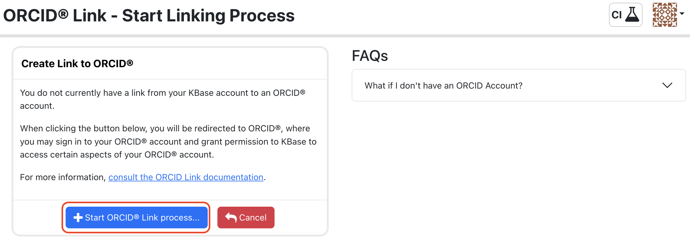
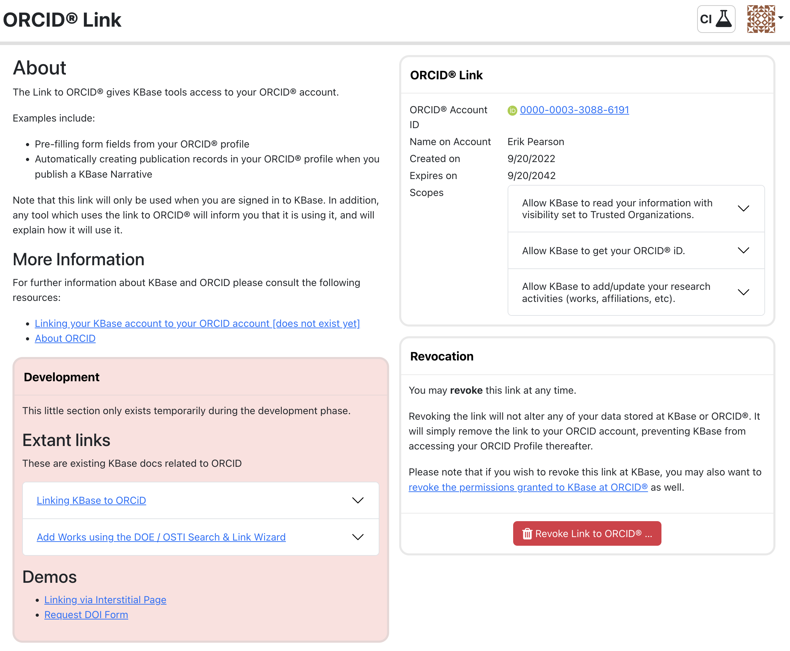

# ORCID Link Usage Docs

An ORCID Link allows KBase to perform certain actions against the ORCID API on behalf of a user.

## Status

This is a working document for an unfinished product, describing the behavior as it exists now on CI.

Note that during prototyping all ORCID interactions are with the ORCID sandbox service. This service behaves identically to their production service, but is isolated and carries certain restrictions (noted below as required).

## How can it do this?

A user creates an ORCID Link ("link") by completing a linking process through the KBase user interface (kbase-ui).

## Yeah, but how?

The end result of the linking process is to store a semi-permanent per-user ORCID authorization token. This token provides authorization for KBase software to use the ORCID API on behalf of the associated user.

## What actions can be conducted?

All actions are conducted on behalf of and only against a single user, the user associated with the ORCID auth token.

The actions include:

- read a user's ORCID profile

- read and write a user's ORCID activities
  
  - We just use it for the "works" - publications

## Linking Process

The primary purpose of the ORCID Link service and front end is to facilitate the creation of a "link" between a user's KBase and ORCID accounts.

This is accomplished by storing an ORCID long term authorization token at KBase in a manner which allows it to be associated with a user's KBase account.

When we speak of the "link", we mean that this ORCID auth token has been stored at KBase in a manner which associates it with a single KBase user.

A link may be revoked by it's user at any time via the kbase user interface.

The ORCID token has an associated "scope", which provides certain privileges for accessing and modifying the ORCID account associated with the token.

## UI

The process of linking and unlinking an ORCID account is conducted by the KBase user themselves, through kbase-ui.

The linking interface is found at the ui path `#orcidlink`, or through the "ORCID Link" menu item in the hamburger menu.

### Workflows

- Simple Link - not linked, already ORCID member

- Link with Sign Up - not linked, not yet an ORCID member

- Link from Process - not linked, linking required or optional for some other process

- Revoke Link - The user removes the ORCID Link

### Simple Workflow

In this simple workflow, it is assumed that the user does not have an ORCID Link, but does have an ORCID account.

The basic linking flow is thus:

1. User logs in to KBase

2. User selects the ORCID Link menu item

   

3. This leads to the ORCID Link "home page"

   

   - This page informs the user that a link doesn't exist yet, and provides a button for linking.

   - If the user's account is already linked, that will be reflected (screen shot at end)

4. User clicks the "Create ORCID Link" button

5. This leads to the ORCID Linking page

   

   - The purpose of this page is to provide an entry point for all linking scenarios

   - It provides information relevant to a user just about to link

   - This feels duplicative ... we'll address this

6. The user clicks the "Create ORCID Link" button

7. This leads to the ORCID Sign In page.

   - (I believe we pass an option to force re-authentication; otherwise the browser
      may skip over Sign In if the user is already signed in.)

   

8. The user signs in

9. This leads to the ORCID "Authorize access" page

   - This page explains the authorizations being granted to KBase

   

10. The user clicks the "Authorize access" button

11. This leads back to KBase, to the "Confirm Link" page

    - This page shows a summary of the ORCID account, the scopes being granted, and allows the user to continue to create the link, or cancel the process

    

12. The user clicks the "Create link to ORCID" button

13. This leads back to the ORCID Link home page.

    - This page now shows the ORCID Link summary, as well as a button to revoke the link

    - The user views the glory of their ORCID Link

    

### Link with ORCID Sign Up

What if a user attempts to create an ORCID Link but does not yet have an ORCID account?

From the ORCID Link point of view, the process is exactly the same.

For the user, they will simply need to sign up for ORCID rather than sign in. After the sign up process, ORCID will resume the linking process.

If a user has not yet signed up for ORCID, the process is exactly the same to the KBase Linking process. This is due to the nature of OAuth - when the KBase process redirects the browser to ORCID to obtain the user's permission, it has no idea whether the user has an account or not. All that is required is that ORCID obtain the user's permission, even if this means the user must create an account first!

#### Instructions

These instructions replace step 8 above.

> Note that as this is the _ORCID sandbox_, the account you create here has nothing to do with your regular ORCID account.

1. From the ORCID Sign in page, click the "Register now" link

   

2. Complete the "Create ORCID Id" form:

   

3. Complete signup step 1

   

   - The ORCID sandbox requires that only "Mailinator" email addresses be used; ORCID will send a confirmation email to this address.

   This is a free public mailbox service. Essentially, anything sent to "mailinator.com", with any account name (foo@mailinator.com, bar@mailinator.com, etc.) all end up in a publicly available inbox.

   To use this email account, you simply search the [Mailinator inbox](https://www.mailinator.com/v4/public/inboxes.jsp) for the address the message was sent to. Thus, when selecting an ORCID sandbox username, try to use something a bit obscure so no-one else can find it before you do!

4. Complete signup step 2

   

5. Complete signup step 3

   

6. Rejoin the linking process at step 9 above.

7. Confirm email address - go to the [Mailinator inbox](https://www.mailinator.com/v4/public/inboxes.jsp)

   

8. Search for the email address entered during ORCID signup.

   

9. Open the message and confirm it:

   

### Link from Process

The ORCID Link tool (starting at step 5 above) is able to accept a url parameter to which it will redirect after creating the ORCID Link.

If some UI process requires or is optionally able to use an ORCID Link (e.g. to fetch the user's ORCID profile for auto-populating a form), it may craft a link to the ORCID Link tool with a return url that will re-enter that UI process. That process just needs to carefully craft the url and process in order to preserve the state of that process.

The ORCID Link prototype includes a small workflow which demonstrates this.

> TODO - go through that process here

### Revoke Link

A user may revoke (remove) the ORCID Link at any time.

This will remove the link from the ORCID Link service.

It will not remove the authorization granted to KBase at ORCID. Messaging to users should make this clear, and provide instructions for removing this authorization.

> TODO - show this in action
